# Employer-Management-Java-Project
Employee Management System base on Java Project using JavaFX for Desktop Application

## class diagram
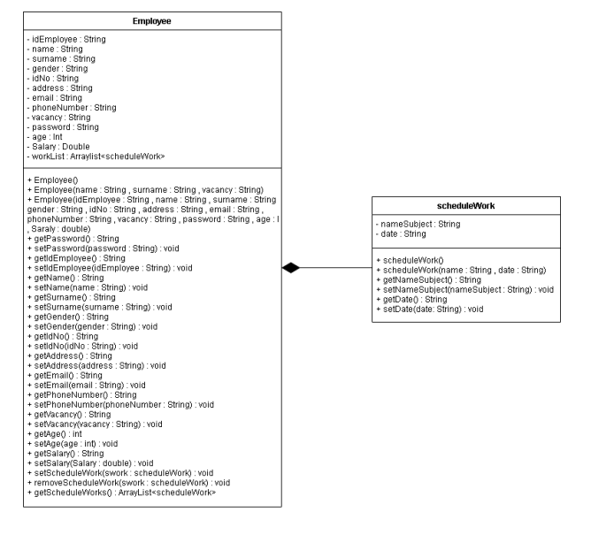

## GUI class diagram
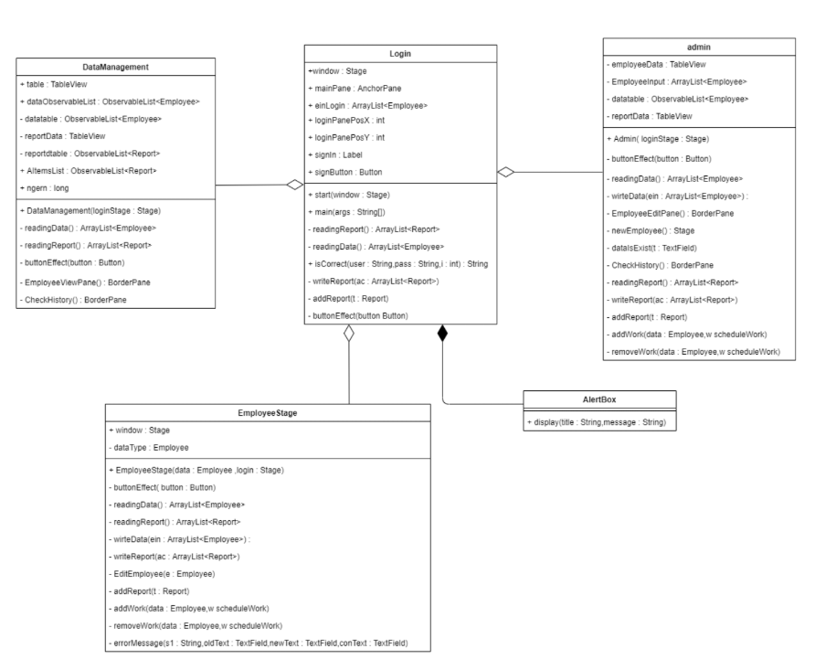

## Storage
database on local file (.dat file)
- EmployeeData.dat
- ReportData.dat

## User Interface
### Sign In
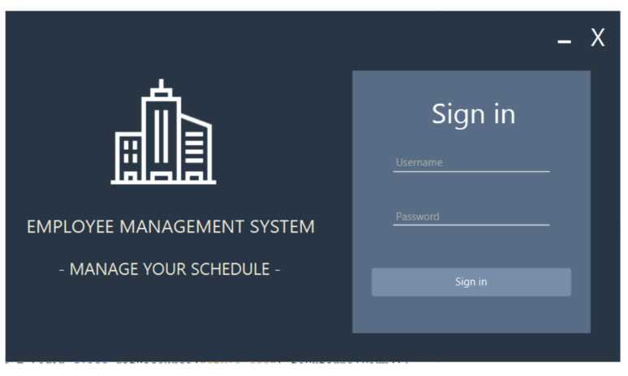

### Employee Information
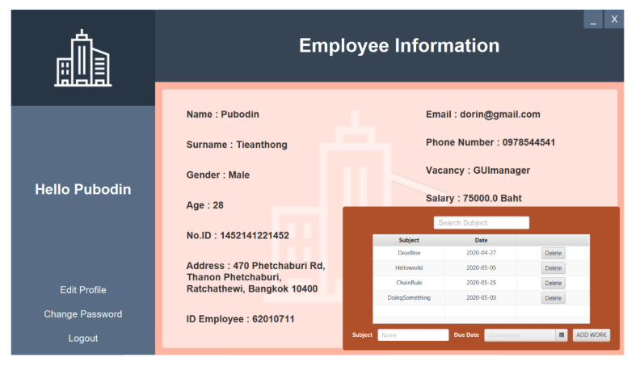
- Change Password

- Edit Profile

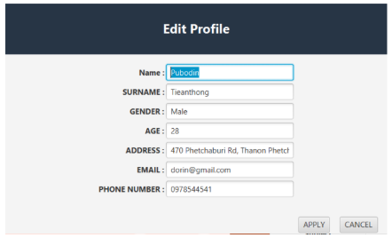

### ADMINISTRATOR
- EmpoloyeeList

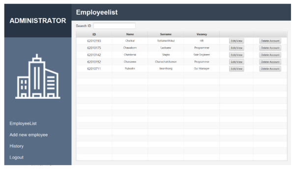

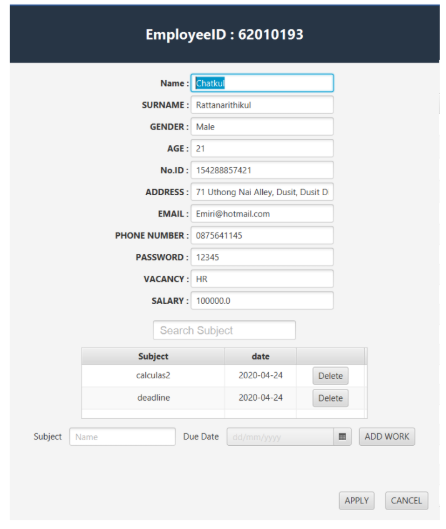

- Add new Employee

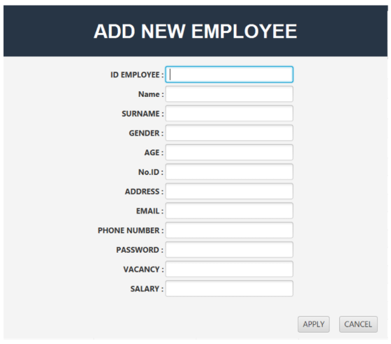

- History

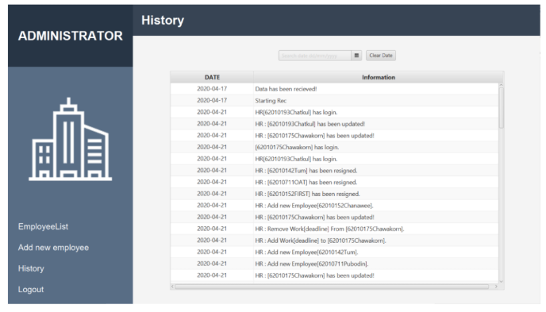

### MANAGER
- EmployeeList

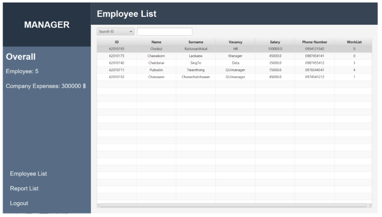

- Report List

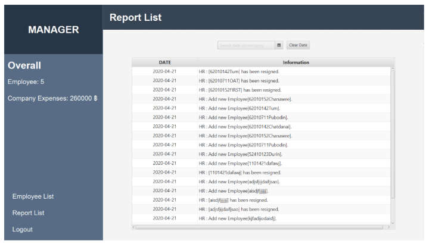

## Document(TH)
[Employee Management System Document](<doc/Employee Management System.pdf>)

